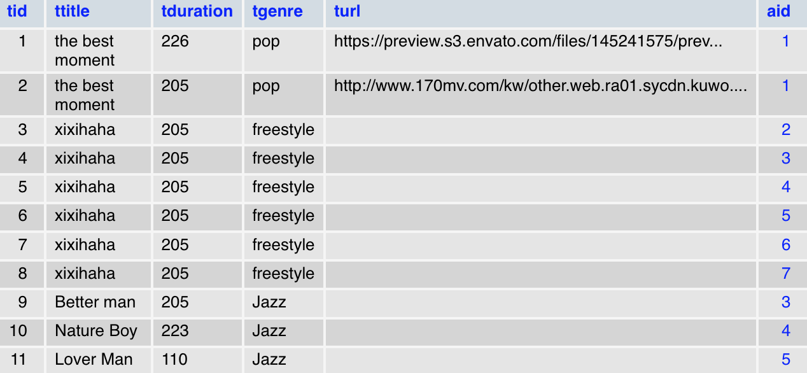
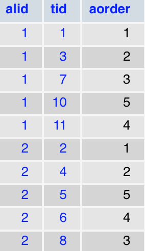
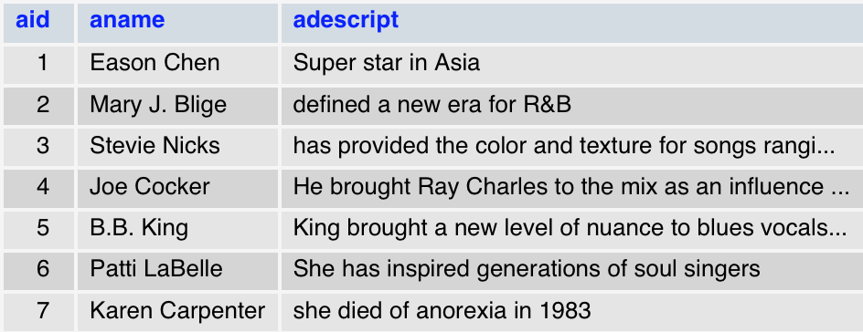
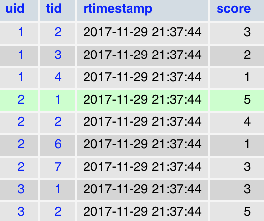
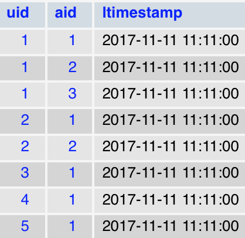

**Track Table**

**Album Table**

**Playlist Table**

**Albumtrack Table**

**Playlisttrack**

**Artists Table**

**Rate Table**

**Likes Table**

**Follow Table**

Design description:

In the table Play, we design a attribute (ptype) to show the source type of the track, if ptype equals to 0, it means that the song is played from a album, and the source id references to an album’s alid; if ptype equals to 1, it means that the song is played from playlist, and the source id references to a playlist’s pid; if ptype equals to 2, the song is played outside any playlist or album, so the source id is null. Because in different cases, the source id references to different attribute of different table, it can’t  be designed as a foreign key. And compared with using several tables to store the three kinds of sources, it will cost a little more space but easily be implemented.

In table Users, profile has ‘name’, ‘email’,’city’, they can be null and users can update their profile after they sign up and log in.

In table Track, we store url in this table, so when we need to play this song, we can just link the url with this song. 

In table Follow, there are two options that we can use, 1.use type to decide the two users’ relation; 2. Use the attribute to decide who follows who. We choose 2, and when we want to see which two users follow each other, we just need to add "a.uid<b.uid" to delete repeated data.				

			

		

